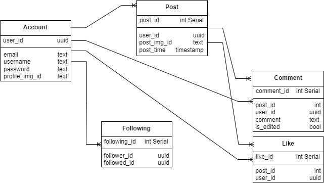
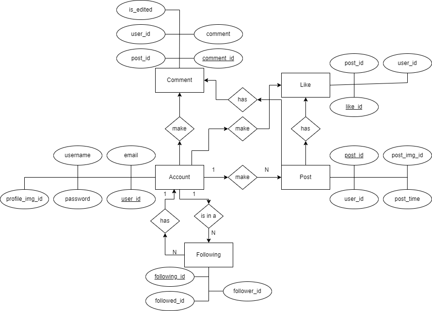

# PROJECT Y
Aplikasi sosial untuk para artis menunjukkan bakatnya

# Diagrams
- UML  

- ERD  

# Tables
                      List of relations
 Schema |            Name             |   Type   |   Owner   
--------+-----------------------------+----------+-----------
 public | accounts                    | table    | georgewtg
 public | comments                    | table    | georgewtg
 public | comments_comment_id_seq     | sequence | georgewtg
 public | followings                  | table    | georgewtg
 public | followings_following_id_seq | sequence | georgewtg
 public | likes                       | table    | georgewtg
 public | likes_like_id_seq           | sequence | georgewtg
 public | posts                       | table    | georgewtg
 public | posts_post_id_seq           | sequence | georgewtg
(9 rows)

                     Table "public.accounts"
     Column     | Type | Collation | Nullable |      Default      
----------------+------+-----------+----------+-------------------
 user_id        | uuid |           | not null | gen_random_uuid()
 username       | text |           | not null | 
 email          | text |           | not null | 
 password       | text |           | not null | 
 profile_img_id | text |           |          | 
Indexes:
    "accounts_pkey" PRIMARY KEY, btree (user_id)
    "accounts_email_key" UNIQUE CONSTRAINT, btree (email)
    "accounts_username_key" UNIQUE CONSTRAINT, btree (username)

                                           Table "public.posts"
   Column    |            Type             | Collation | Nullable |                Default                 
-------------+-----------------------------+-----------+----------+----------------------------------------
 post_id     | integer                     |           | not null | nextval('posts_post_id_seq'::regclass)
 user_id     | uuid                        |           | not null | 
 post_img_id | text                        |           | not null | 
 post_time   | timestamp without time zone |           |          | now()

                                  Table "public.comments"
   Column   |  Type   | Collation | Nullable |                   Default                    
------------+---------+-----------+----------+----------------------------------------------
 comment_id | integer |           | not null | nextval('comments_comment_id_seq'::regclass)
 post_id    | integer |           | not null | 
 user_id    | uuid    |           | not null | 
 comment    | text    |           | not null | 
 is_edited  | boolean |           |          | false

                               Table "public.likes"
 Column  |  Type   | Collation | Nullable |                Default                 
---------+---------+-----------+----------+----------------------------------------
 like_id | integer |           | not null | nextval('likes_like_id_seq'::regclass)
 post_id | integer |           | not null | 
 user_id | uuid    |           | not null | 

                                    Table "public.followings"
    Column    |  Type   | Collation | Nullable |                     Default                      
--------------+---------+-----------+----------+--------------------------------------------------
 following_id | integer |           | not null | nextval('followings_following_id_seq'::regclass)
 follower_id  | uuid    |           | not null | 
 followed_id  | uuid    |           | not null | 

